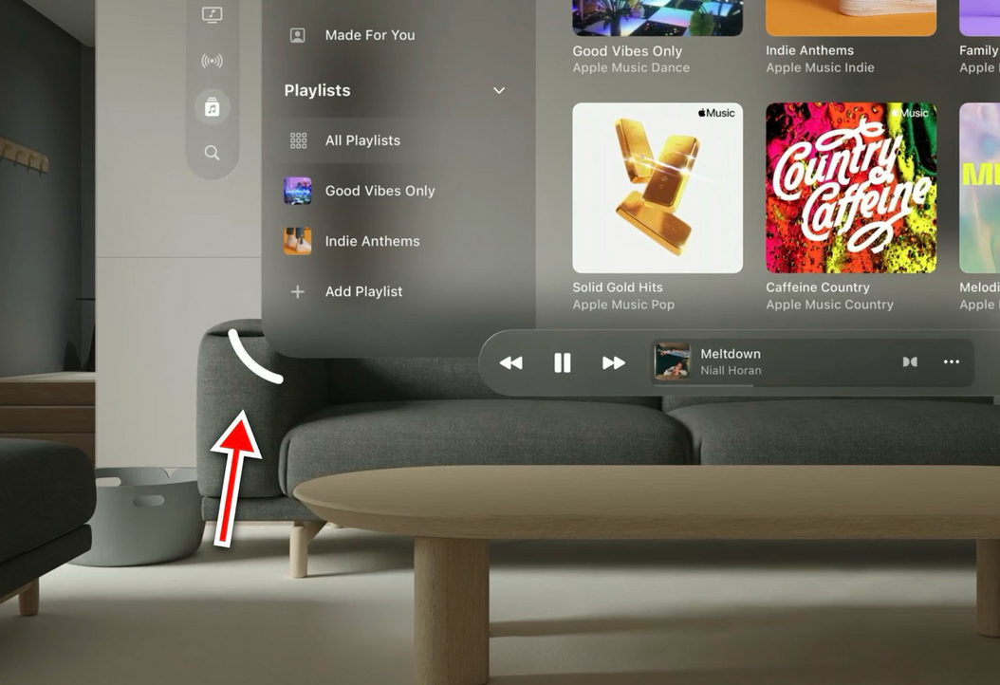
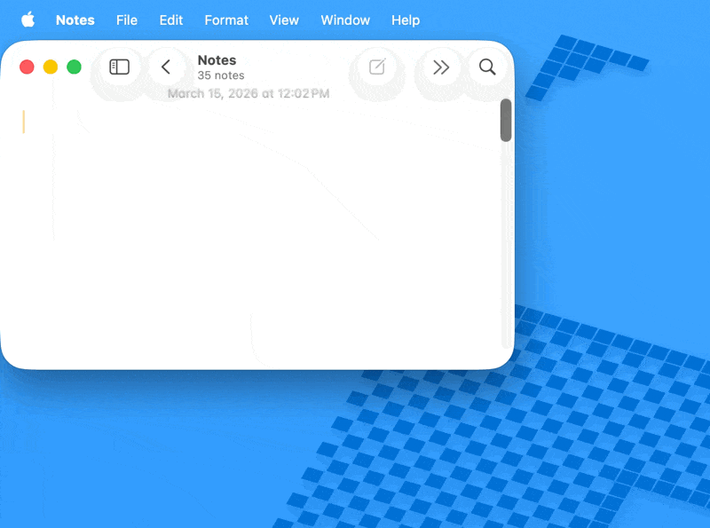

# Cornr Cornr

There was a lot of talk on the Apple fan internet in early 2026, that I think started with this post about [the macOS Tahoe window resize problem](https://noheger.at/blog/2026/01/11/the-struggle-of-resizing-windows-on-macos-tahoe/).  It even got the interest of [John Gruber](https://daringfireball.net/2026/01/resizing_windows_macos_26).

Tahoe's questionable window resizing was on my mind one night recently when I was using my Vision Pro.  As I looked down at the corner of a visionOS window and I saw its resize affordance appear, I had the idea that a little indicator like that - outside of the window - was exactly what macOS Tahoe was missing.  For those unfamiliar, it's a white quarter-circle that appears a few points away from the corner of a visionOS window.  A picture will say it so much more clearly than my words can:

So I asked Claude Code to build this feature on macOS.  I think the results are pretty good!

It's a simple menu bar app, with a Settings panel.  It does need accessibility permissions, and while I can promise that *I* didn't put anything malicious in the app, I can't vouch for what my friend Claude may have done (since I literally haven't looked at the code).

I had a little trouble getting the pixel values exactly right, so I threw a lot of them into Settings, though I think the defaults that it's shipping with are pretty close.

It's on [github](https://github.com/darinkelkhoff/cornrCornr) if anyone wants to read it or do whatever with it (there's an MIT license included).  Or there's a binary available to [download here](https://github.com/darinkelkhoff/cornrCornr/releases/download/0.1/CornrCornr.zip).

